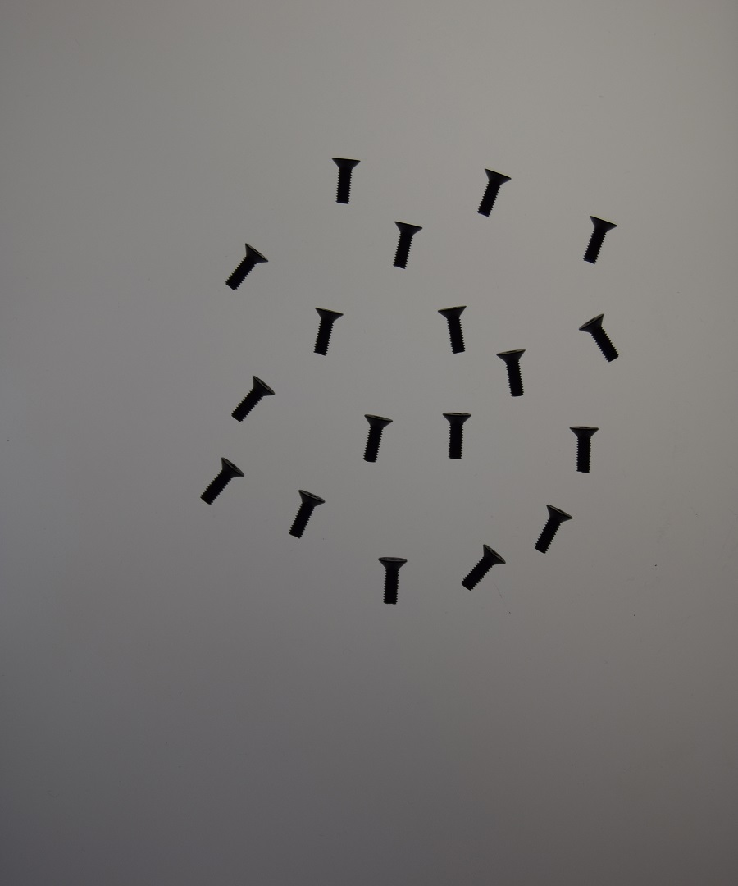
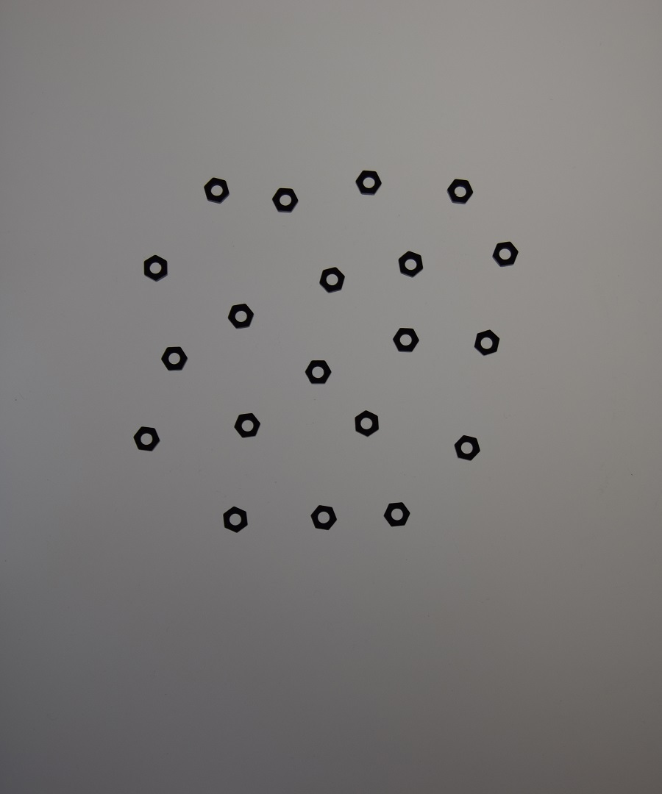
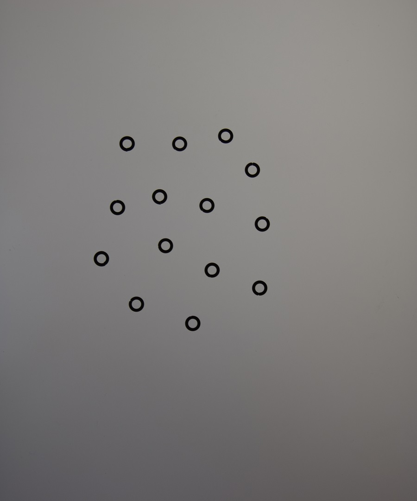
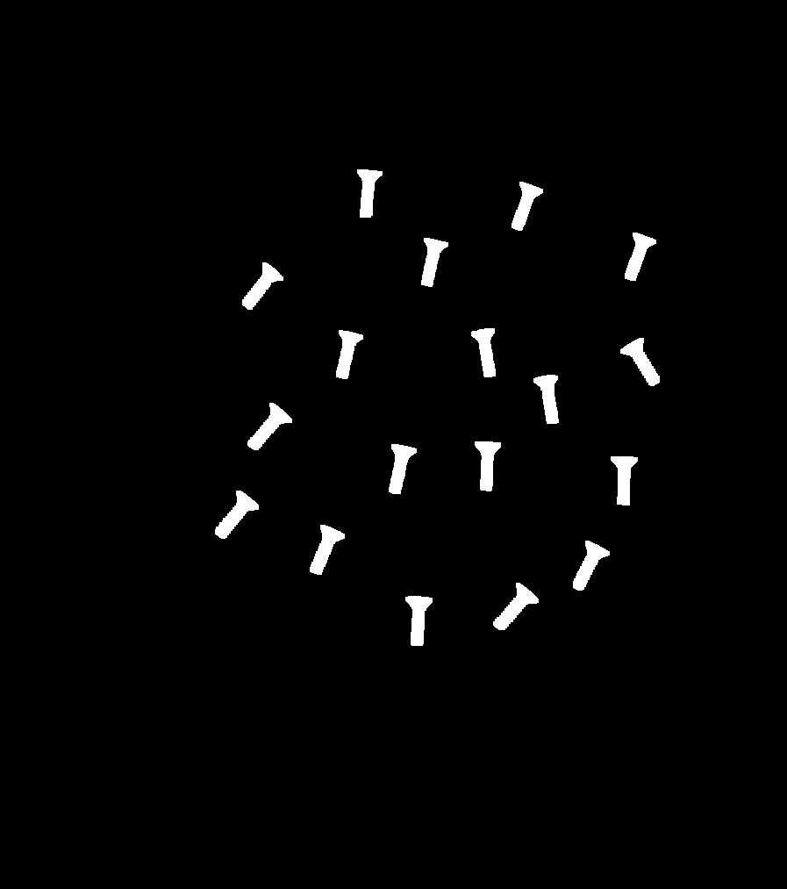
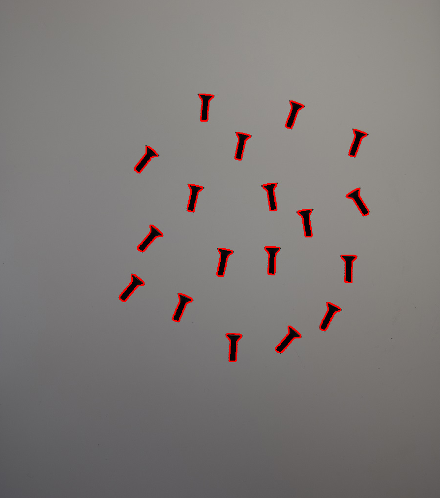
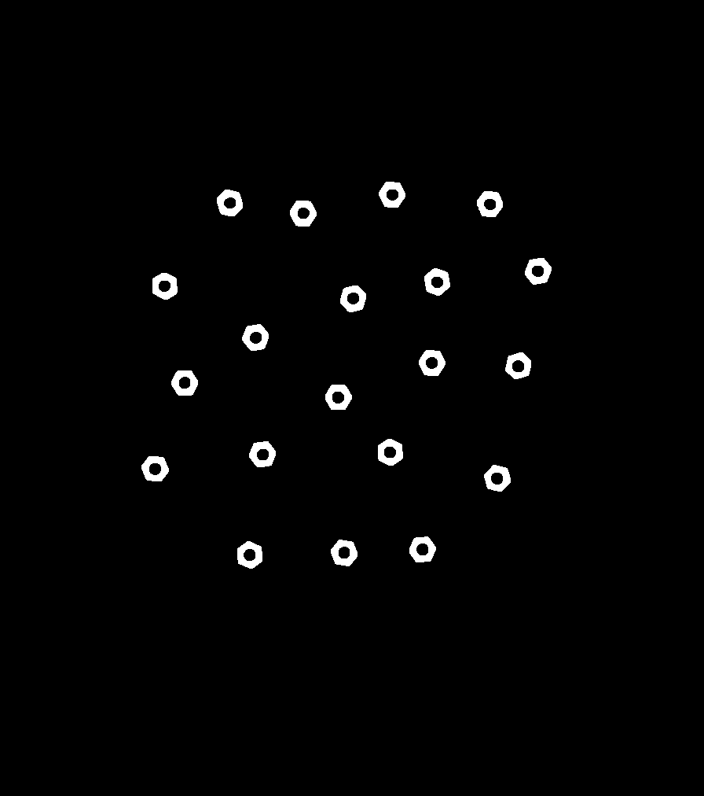
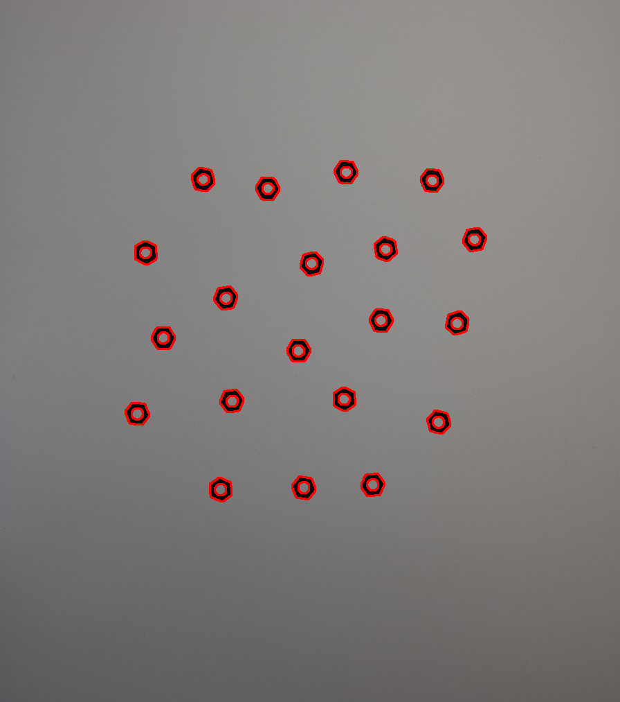
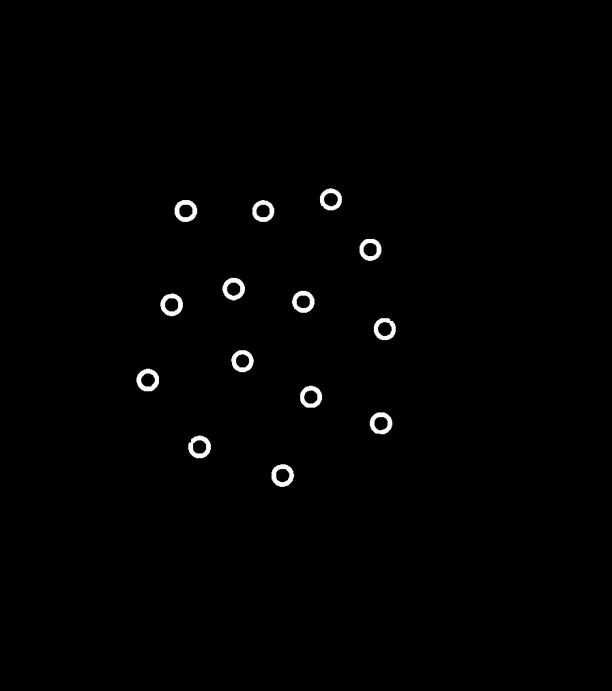
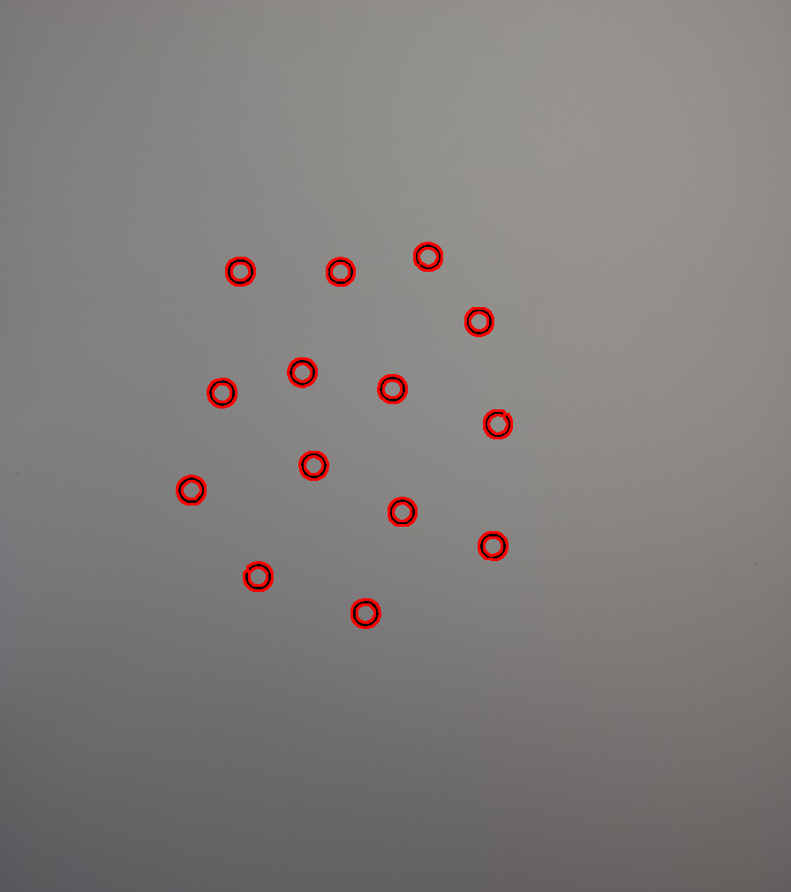
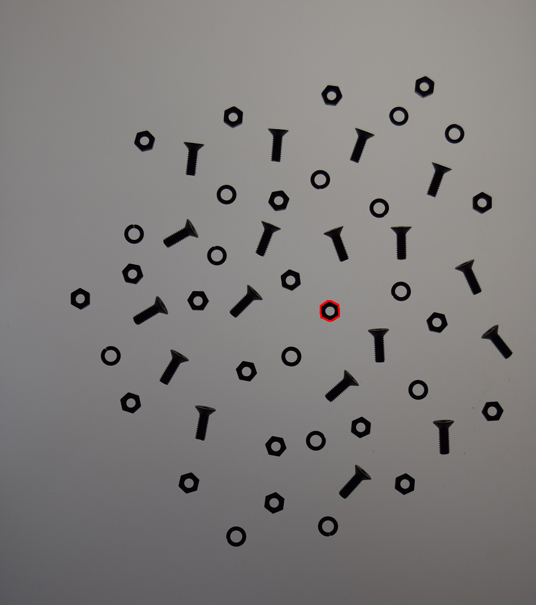

En este ejemplo se pretende determinar el numero de tornillos, tuercas y arandelas presentes en una imagen utilizando un clasificador bayesiano.

En la fase de entrenamiento se pasan 3 imagenes que contienen elementos de un único tipo, y se toman 2 carácteristicas para estudiar los objetos: el perímetro y el área.
En el caso de las arandelas y las tuercas, se utiliza la jerarquía de contornos de OpenCV para restar el área del objeto correspondiente al agujero que tienen estos elementos
de esta forma es posible diferenciar con más exactitud entre tuerca y arandela.

Los resultados obtenidos por el programa con las imagenes de prueba han sido del 100% de aciertos.

Fase de entrenamiento:
Tornillos

Tuercas

Arandelas

Fase de reconicimiento:

